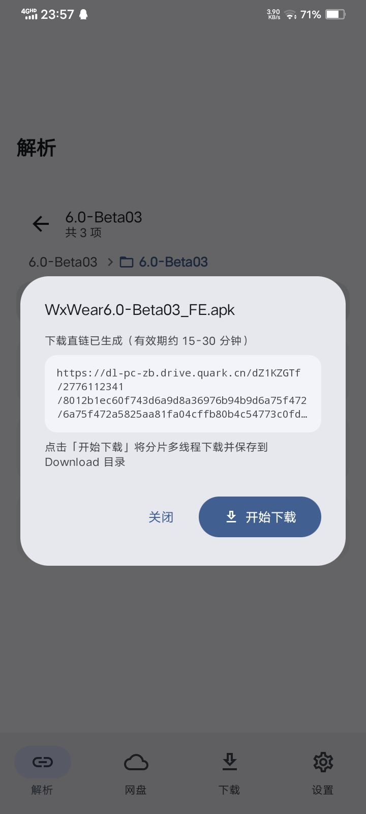

# 析盘

> **把网盘链接拆开，把文件满速搬回家。**
>
> 粘贴分享链接 → 一键解析 → 极速下载。没有会员墙，没有限速条，没有广告，一个字：快。

---

## 它解决什么问题

网盘链接最大的痛，不是下载，而是**下载太慢**。

- 不开会员？速度被卡死在几百 KB/s；
- 开了会员？下载完链接就过期，转存占满自己的网盘；
- 在浏览器里下？后台一下就没速度，屏幕一亮就断。

**析盘**把这些破事全部干掉：拿到分享链接，直接解析出真实文件直链，用多线程分片并发拉取，全程绕开官方的速度枷锁——你只负责粘贴，剩下的交给它。

---

## 为什么选它

| | 析盘 | 官方客户端 | 网页版 |
|:---|:---:|:---:|:---:|
| 会员速度 | 免费拉满 | 收费 | 限速 |
| 后台下载 | 稳定不掉线 | 经常暂停 | 断流 |
| 广告 | 无 | 满屏 | 满屏 |
| 占用网盘空间 | 不转存，临时文件自动清理 | 占满 | — |
| 断点续传 | 支持，暂停再开不重下 | 支持 | 不支持 |

一句话：**官方来只给 10% 的速度，析盘把剩下 90% 还给你。**

---

## 支持的网盘

- 夸克网盘
- UC 网盘
- 迅雷网盘
- 123 云盘
- 139 网盘（和彩云）
- 百度网盘（支持，但提醒：账号容易被风控，谨慎使用）

> 其它平台？提 [issue](https://github.com/ly5201314gjx/YunX/issues) 就行，我们按呼声排序。

---

## 核心功能

### 一键解析，自动识别
夸克 / UC / 迅雷 / 百度 / 123 / 139 分享链接丢进来就认，提取码自动带出。做个链接的"翻译官"，别的什么都不用碰。

### 不转存，直接搬
解析出的文件走**直链下载**，不占用你的网盘空间。取链用的临时转存文件，下载完自动清理，网盘还是你的网盘。

### 多线程分片并发
文件被切成多个分片、多条连接同时拉取。弹窗一句讲完就是：**开头快是本事，结尾不掉速才是真功夫**——全路段速度曲线平坦，不会出现"下到 70% 突然瘫了"的经典剧情。

### 断点续传
下到一半去干别的？暂停。回来继续，从断点接着下，一秒不浪费。

### 下载管理一条龙
进度、速度、剩余时间、线程数实时可见；暂停 / 继续 / 删除 / 打开，想怎么安排就怎么安排。

### 剪贴板智能识别
复制链接切回应用，自动弹出解析提示，点一下就完事。

### 液态玻璃界面
毛玻璃导航 + 丝滑页面过渡。好看是加分项，但快和稳才是底线。

---

## 界面速览

| 解析输入 | 分享解析 | 下载管理 |
|:---:|:---:|:---:|
|  |  |  |

| 网盘登录 | 设置 | 关于 |
|:---:|:---:|:---:|
|  |  |  |

---

## 快速上手

1. 「网盘」页登录你想用的网盘账号；
2. 「解析」页粘贴分享链接（带不带提取码都行）；
3. 浏览分享内容，点目标文件拿直链；
4. 「下载」页看着它跑完，点击打开文件。

全程 4 步、2 个页面、0 个广告。

---

## 下载速度是怎么"变快"的

拆开来看，析盘的下载引擎做了几件事：

- **Range 分片**：把大文件切成多个区间，多线程并发请求，把单连接的带宽天花板直接掀掉；
- **连接轮换**：每条连接下载量可控，规避 CDN"连接越老越慢"的隐性限速——后段不塌速，结尾不趴窝；
- **末段细块收尾**：最后几 MB 切成更小的块并行收割，宁可多开几次请求，也不让最后一块卡你几分钟；
- **断点续传**：分片落盘带校验，暂停 / 重启 / 掉线都不怕，不给你下个坏文件。

算下来的结果：**同样的链接、同样的网络，析盘的下载体验就是比官方快一截，而且到尾都稳。**

---

## 技术栈

- Kotlin + Coroutines
- Jetpack Compose + Material 3
- Room（凭证与下载任务持久化，安全加密存储）
- OkHttp（网络请求 + 分片下载）
- Android Keystore（账号凭证落盘加密）

## 构建

要求：minSdk 21，targetSdk 34。

```bash
git clone https://github.com/ly5201314gjx/YunX.git
```

Android Studio 打开直接跑即可，AndroidIDE 环境也可构建。

---

## 免责声明

本项目仅供个人学习与技术交流，**请勿用于商业用途**。下载内容版权归原作者所有，请在下载后 24 小时内删除。使用本项目产生的一切后果由使用者自行承担。

## 开源协议

基于 [GNU AGPL-3.0](https://www.gnu.org/licenses/agpl-3.0.html) 协议开源，详见 [LICENSE](./LICENSE)。

## 说明

部分网盘平台的解析基于抓包分析与开源项目（如 alist）的协议研究整理。接口随官方调整可能失效，以实际运行为准。

---

## 防倒卖提醒

**析盘完全免费开源。** 如果你在任何一个渠道被要求付钱下载它——你被骗了，请立刻退款维权。看见倒卖请直接举报。

## Star History

[](https://www.star-history.com/?repos=ly5201314gjx%2FYunX&type=date&legend=top-left)